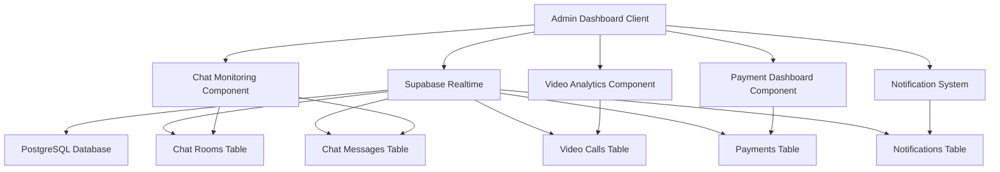
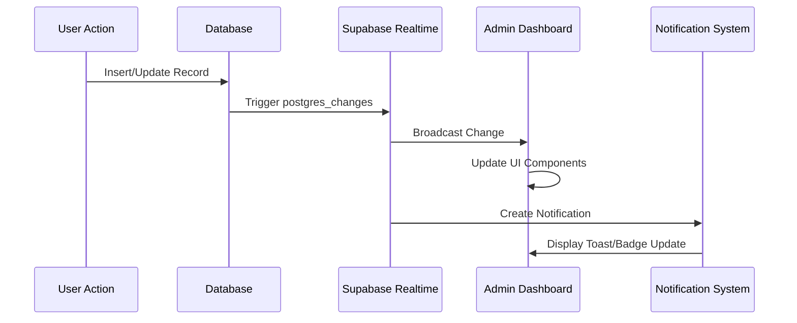

# Design Document

## Overview

The Admin Monitoring Dashboard is a real-time monitoring system that extends the existing admin dashboard with comprehensive oversight capabilities. The system leverages Supabase Realtime (free tier) to provide live updates across chat monitoring, video call analytics, payment tracking, and admin notifications. The design emphasizes performance, scalability, and user experience while maintaining security and proper access controls.

## Architecture

### High-Level Architecture



### Real-time Data Flow



## Components and Interfaces

### 1. Chat Monitoring Component (`components/admin/chat-monitoring.tsx`)

**Purpose:** Provides real-time monitoring of active chat conversations with admin intervention capabilities.

**Key Features:**

- Live chat room list with participant information
- Real-time message display for selected conversations
- Admin intervention buttons with predefined messages
- Message statistics and activity tracking

**State Management:**

```typescript
interface ChatMonitoringState {
  activeChatRooms: ChatRoom[];
  selectedRoom: string | null;
  messages: ChatMessage[];
  isLoading: boolean;
}

interface ChatRoom {
  id: string;
  appointment_id: string;
  status: string;
  created_at: string;
  message_count: number;
  last_message: string;
  last_message_at: string;
  appointment: {
    doctor: { user: { name: string } };
    patient: { user: { name: string } };
  };
}
```

**Real-time Subscriptions:**

- `chat_messages` table changes for live message updates
- `chat_rooms` table changes for room status updates

### 2. Video Call Analytics Component (`components/admin/video-call-analytics.tsx`)

**Purpose:** Displays comprehensive video call metrics and monitors active calls in real-time.

**Key Features:**

- Real-time call statistics (total, active, success rate, average duration)
- Live active calls monitoring with participant details
- Recent calls history with status and duration
- Performance alerts for low success rates

**State Management:**

```typescript
interface VideoCallAnalyticsState {
  stats: VideoCallStats;
  activeCalls: ActiveCall[];
  recentCalls: VideoCall[];
  isLoading: boolean;
}

interface VideoCallStats {
  totalCalls: number;
  activeCalls: number;
  completedCalls: number;
  failedCalls: number;
  avgDuration: number;
  totalDuration: number;
  successRate: number;
}
```

**Real-time Subscriptions:**

- `video_calls` table changes for call status updates
- Calculated metrics updates on data changes

### 3. Payment Dashboard Component (`components/admin/payment-dashboard.tsx`)

**Purpose:** Monitors payment transactions and financial metrics with real-time updates.

**Key Features:**

- Financial KPIs (total revenue, daily/weekly/monthly revenue)
- Payment method distribution statistics
- Recent transaction monitoring with detailed information
- Payment status alerts and failure analysis

**State Management:**

```typescript
interface PaymentDashboardState {
  stats: PaymentStats;
  recentPayments: Payment[];
  isLoading: boolean;
}

interface PaymentStats {
  totalRevenue: number;
  todayRevenue: number;
  weekRevenue: number;
  monthRevenue: number;
  pendingPayments: number;
  completedPayments: number;
  failedPayments: number;
  refundedPayments: number;
  averageAmount: number;
  paymentMethodStats: {
    stripe: number;
    paypal: number;
    mercadopago: number;
  };
}
```

**Real-time Subscriptions:**

- `payments` table changes for transaction updates
- Automatic recalculation of financial metrics

### 4. Admin Notification System

**Components:**

- `hooks/use-admin-notifications.ts` - Custom hook for notification management
- `components/admin/notification-bell.tsx` - UI component for notification display

**Purpose:** Provides real-time notifications about platform events with proper categorization and management.

**Key Features:**

- Real-time notification creation from database events
- Categorized notifications (chat, payment, video_call, system)
- Unread count tracking and badge display
- Toast notifications for immediate alerts
- Notification history and read status management

**State Management:**

```typescript
interface AdminNotification {
  id: string;
  type: "chat" | "payment" | "video_call" | "system";
  title: string;
  message: string;
  data?: any;
  is_read: boolean;
  created_at: string;
}

interface NotificationState {
  notifications: AdminNotification[];
  unreadCount: number;
}
```

### 5. Dashboard Integration

**Enhanced Admin Dashboard Client (`app/admin/admin-dashboard-client.tsx`):**

- Extended tab navigation with new monitoring sections
- Real-time statistics overview in main dashboard
- Integrated notification bell in navigation header
- Consistent styling and responsive design

**New Tab Structure:**

- Overview (existing + real-time stats)
- Users (existing)
- Appointments (existing)
- **Chat** (new - chat monitoring)
- **Video** (new - video analytics)
- **Payments** (new - payment dashboard)
- **Reports** (new - comprehensive reports)

## Data Models

### Enhanced Database Schema

**Notifications Table:**

```sql
CREATE TABLE notifications (
  id UUID PRIMARY KEY DEFAULT gen_random_uuid(),
  user_id TEXT NOT NULL, -- 'admin' for admin notifications
  type TEXT NOT NULL CHECK (type IN ('chat', 'payment', 'video_call', 'system')),
  title TEXT NOT NULL,
  message TEXT NOT NULL,
  data JSONB,
  is_read BOOLEAN DEFAULT FALSE,
  created_at TIMESTAMP WITH TIME ZONE DEFAULT NOW()
);

CREATE INDEX idx_notifications_user_unread ON notifications(user_id, is_read);
CREATE INDEX idx_notifications_created_at ON notifications(created_at DESC);
```

**Enhanced Chat Messages (for admin tracking):**

```sql
ALTER TABLE chat_messages ADD COLUMN message_type TEXT DEFAULT 'user' CHECK (message_type IN ('user', 'system', 'admin'));
```

### Real-time Subscription Channels

**Admin Monitoring Channel:**

```typescript
const adminMonitoringChannel = supabase
  .channel("admin-monitoring")
  .on(
    "postgres_changes",
    {
      event: "*",
      schema: "public",
      table: "chat_messages",
    },
    handleChatUpdate
  )
  .on(
    "postgres_changes",
    {
      event: "*",
      schema: "public",
      table: "video_calls",
    },
    handleVideoCallUpdate
  )
  .on(
    "postgres_changes",
    {
      event: "*",
      schema: "public",
      table: "payments",
    },
    handlePaymentUpdate
  )
  .subscribe();
```

## Error Handling

### Real-time Connection Management

**Connection Resilience:**

- Automatic reconnection on connection loss
- Exponential backoff for failed connections
- Connection status indicators for admin users
- Graceful degradation when real-time is unavailable

**Error Recovery Strategies:**

```typescript
const setupRealtimeWithRetry = (retryCount = 0) => {
  const maxRetries = 5;
  const backoffDelay = Math.min(1000 * Math.pow(2, retryCount), 30000);

  try {
    const channel = supabase.channel("admin-monitoring");
    // ... setup subscriptions

    channel.subscribe((status) => {
      if (status === "SUBSCRIBED") {
        setConnectionStatus("connected");
        setRetryCount(0);
      } else if (status === "CHANNEL_ERROR" && retryCount < maxRetries) {
        setTimeout(() => setupRealtimeWithRetry(retryCount + 1), backoffDelay);
      }
    });
  } catch (error) {
    console.error("Realtime setup error:", error);
    if (retryCount < maxRetries) {
      setTimeout(() => setupRealtimeWithRetry(retryCount + 1), backoffDelay);
    }
  }
};
```

### Data Validation and Sanitization

**Input Validation:**

- Sanitize admin intervention messages
- Validate notification data before creation
- Ensure proper data types for real-time updates

**Security Measures:**

- Admin role verification for all monitoring endpoints
- Rate limiting for admin actions
- Audit logging for admin interventions

## Testing Strategy

### Unit Testing

**Component Testing:**

- Test real-time data updates with mock Supabase client
- Verify notification creation and management
- Test admin intervention functionality
- Validate data formatting and display logic

**Hook Testing:**

- Test `use-admin-notifications` hook with various scenarios
- Verify real-time subscription management
- Test error handling and retry logic

### Integration Testing

**Real-time Functionality:**

- Test end-to-end real-time updates across all components
- Verify notification delivery and display
- Test admin intervention message delivery
- Validate cross-component data synchronization

**Database Integration:**

- Test notification table operations
- Verify real-time trigger functionality
- Test data aggregation for analytics

### Performance Testing

**Load Testing:**

- Test dashboard performance with high message volumes
- Verify real-time update performance under load
- Test notification system with multiple concurrent events

**Memory Management:**

- Monitor for memory leaks in long-running sessions
- Test cleanup of real-time subscriptions
- Verify efficient data updates without unnecessary re-renders

### Security Testing

**Access Control:**

- Verify admin-only access to monitoring features
- Test unauthorized access prevention
- Validate data privacy in monitoring displays

**Data Security:**

- Test secure handling of sensitive information
- Verify audit logging functionality
- Test protection against injection attacks in admin messages

## Performance Considerations

### Optimization Strategies

**Real-time Updates:**

- Debounce rapid updates to prevent UI thrashing
- Use virtual scrolling for large message lists
- Implement efficient data structures for real-time updates

**Data Loading:**

- Implement pagination for historical data
- Use lazy loading for non-critical components
- Cache frequently accessed data with proper invalidation

**Memory Management:**

- Proper cleanup of real-time subscriptions on unmount
- Efficient state updates to minimize re-renders
- Use React.memo and useMemo for expensive calculations

### Scalability Considerations

**Database Performance:**

- Proper indexing for real-time queries
- Efficient aggregation queries for analytics
- Connection pooling for database access

**Real-time Limits:**

- Monitor Supabase Realtime usage to stay within free tier limits
- Implement batching for high-frequency updates
- Use efficient channel management to minimize connections

## Security Architecture

### Authentication and Authorization

**Admin Access Control:**

```typescript
const requireAdminAccess = (session: Session | null) => {
  if (!session || session.user.role !== "ADMIN") {
    throw new Error("Admin access required");
  }
};
```

**Data Access Patterns:**

- Row Level Security (RLS) policies for admin data access
- Secure API endpoints with proper authentication
- Audit logging for all admin actions

### Data Privacy

**Information Display:**

- Mask sensitive payment information in displays
- Protect personally identifiable information in chat monitoring
- Secure handling of medical information in conversations

**Audit Trail:**

```sql
CREATE TABLE admin_actions (
  id UUID PRIMARY KEY DEFAULT gen_random_uuid(),
  admin_id UUID REFERENCES users(id),
  action_type TEXT NOT NULL,
  target_id TEXT,
  details JSONB,
  created_at TIMESTAMP WITH TIME ZONE DEFAULT NOW()
);
```

This design provides a comprehensive, scalable, and secure foundation for the Admin Monitoring Dashboard while leveraging Supabase Realtime's free tier capabilities effectively.
