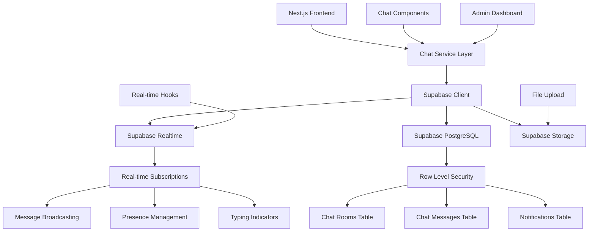
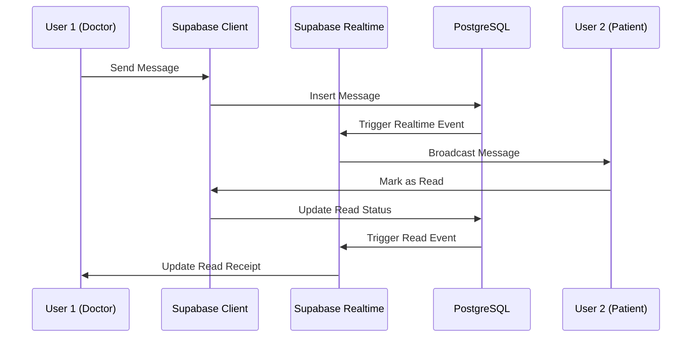

# Design Document

## Overview

The real-time chat system for Medica Movil is designed to provide seamless communication between doctors and patients during virtual consultations using Supabase Realtime capabilities. The system builds upon the existing Supabase infrastructure and chat foundation, implementing a comprehensive solution that includes real-time messaging, file sharing, connection management, and administrative monitoring.

The architecture leverages Supabase's native real-time features to eliminate the need for external WebSocket services, providing a cost-effective and scalable solution that integrates seamlessly with the existing PostgreSQL database and authentication system.

## Architecture

### System Architecture Overview



### Real-time Communication Flow



### Data Flow Architecture

The system implements a layered architecture with clear separation of concerns:

1. **Presentation Layer**: React components for chat interface
2. **Service Layer**: Chat service for business logic and API calls
3. **Real-time Layer**: Supabase Realtime for live updates
4. **Data Layer**: PostgreSQL with Row Level Security
5. **Storage Layer**: Supabase Storage for file attachments

## Components and Interfaces

### Core Service Layer

#### ChatService Class

The `ChatService` class serves as the central hub for all chat operations:

```typescript
interface ChatServiceInterface {
  // Room Management
  getOrCreateChatRoom(appointmentId: string): Promise<ChatRoom | null>;
  getActiveChatRooms(): Promise<ChatRoom[]>;

  // Message Operations
  getMessages(roomId: string): Promise<ChatMessage[]>;
  sendMessage(
    roomId: string,
    senderId: string,
    content: string,
    type?: MessageType,
    fileData?: FileData
  ): Promise<boolean>;
  markMessagesAsRead(roomId: string, userId: string): Promise<void>;

  // Real-time Subscriptions
  subscribeToMessages(
    roomId: string,
    callbacks: MessageCallbacks
  ): RealtimeChannel;
  unsubscribeFromMessages(roomId: string): void;

  // File Operations
  uploadFile(file: File, roomId: string): Promise<string | null>;
}
```

#### Real-time Hook Interface

The `useChat` hook provides a React-friendly interface for chat functionality:

```typescript
interface UseChatReturn {
  chatRoom: ChatRoom | null;
  messages: ChatMessage[];
  isLoading: boolean;
  isConnected: boolean;
  newMessage: string;
  setNewMessage: (message: string) => void;
  isSending: boolean;
  sendMessage: (content?: string) => Promise<boolean>;
  sendFile: (file: File) => Promise<boolean>;
  unreadCount: number;
}
```

### Real-time Communication Components

#### Message Broadcasting System

The system uses Supabase's real-time channels to broadcast messages:

```typescript
interface RealtimeSubscription {
  channel: string;
  event: "INSERT" | "UPDATE" | "DELETE";
  schema: "public";
  table: "chat_messages";
  filter: `room_id=eq.${roomId}`;
}
```

#### Connection Management

Connection status is managed through a centralized system:

```typescript
interface ConnectionStatus {
  isConnected: boolean;
  isReconnecting: boolean;
  lastConnected: Date | null;
  reconnectAttempts: number;
}
```

### User Interface Components

#### ChatInterface Component

The main chat interface provides a complete messaging experience:

- Message display with proper grouping and timestamps
- Real-time message updates and read receipts
- File upload with drag-and-drop support
- Connection status indicators
- Typing indicators

#### ChatRoomList Component

Displays available chat rooms with:

- Unread message counts
- Last message previews
- Appointment context information
- Search and filtering capabilities

## Data Models

### Enhanced Database Schema

The system utilizes the existing Prisma schema with specific focus on chat-related models:

#### ChatRoom Model

```prisma
model ChatRoom {
  id            String        @id @default(cuid())
  appointmentId String        @unique
  patientId     String
  doctorId      String
  isActive      Boolean       @default(true)
  startedAt     DateTime      @default(now())
  endedAt       DateTime?
  createdAt     DateTime      @default(now())
  updatedAt     DateTime      @updatedAt

  // Relations
  appointment   Appointment   @relation(fields: [appointmentId], references: [id])
  patient       User          @relation("PatientChatRooms", fields: [patientId], references: [id])
  doctor        Doctor        @relation("DoctorChatRooms", fields: [doctorId], references: [id])
  messages      ChatMessage[]
  videoSessions VideoSession[]
}
```

#### ChatMessage Model

```prisma
model ChatMessage {
  id          String      @id @default(cuid())
  chatRoomId  String
  senderId    String
  content     String?
  messageType MessageType @default(TEXT)
  fileUrl     String?
  fileName    String?
  fileSize    Int?
  isRead      Boolean     @default(false)
  sentAt      DateTime    @default(now())

  // Relations
  chatRoom    ChatRoom    @relation(fields: [chatRoomId], references: [id])
  sender      User        @relation(fields: [senderId], references: [id])
}
```

### Supabase Storage Structure

File storage is organized hierarchically:

```
chat-files/
├── {roomId}/
│   ├── images/
│   │   └── {timestamp}-{filename}
│   ├── documents/
│   │   └── {timestamp}-{filename}
│   └── other/
│       └── {timestamp}-{filename}
```

## Error Handling

### Connection Error Management

The system implements comprehensive error handling for real-time connections:

1. **Automatic Reconnection**: Exponential backoff strategy for reconnection attempts
2. **Offline Detection**: Browser API integration for network status monitoring
3. **Message Queuing**: Local storage of messages when offline
4. **Error Boundaries**: React error boundaries for graceful failure handling

### Message Delivery Guarantees

```typescript
interface MessageDeliveryStrategy {
  // Retry failed messages with exponential backoff
  retryFailedMessages(): Promise<void>;

  // Queue messages when offline
  queueOfflineMessages(message: ChatMessage): void;

  // Sync queued messages when connection restored
  syncQueuedMessages(): Promise<void>;

  // Handle duplicate message detection
  deduplicateMessages(messages: ChatMessage[]): ChatMessage[];
}
```

### File Upload Error Handling

1. **Size Validation**: Client-side validation before upload
2. **Type Validation**: MIME type checking and file extension validation
3. **Upload Progress**: Progress tracking with cancellation support
4. **Retry Logic**: Automatic retry for failed uploads
5. **Cleanup**: Automatic cleanup of failed uploads

## Security Implementation

### Row Level Security Policies

Comprehensive RLS policies ensure data security:

```sql
-- Chat Rooms Access Policy
CREATE POLICY "Users can view chat rooms for their appointments"
ON chat_rooms FOR SELECT USING (
  appointment_id IN (
    SELECT id FROM appointments
    WHERE doctor_id IN (SELECT id FROM doctors WHERE user_id = auth.uid())
    OR patient_id IN (SELECT id FROM patients WHERE user_id = auth.uid())
  )
);

-- Chat Messages Access Policy
CREATE POLICY "Users can view messages in their chat rooms"
ON chat_messages FOR SELECT USING (
  room_id IN (
    SELECT id FROM chat_rooms WHERE appointment_id IN (
      SELECT id FROM appointments
      WHERE doctor_id IN (SELECT id FROM doctors WHERE user_id = auth.uid())
      OR patient_id IN (SELECT id FROM patients WHERE user_id = auth.uid())
    )
  )
);

-- Message Insert Policy
CREATE POLICY "Users can insert messages in their chat rooms"
ON chat_messages FOR INSERT WITH CHECK (
  room_id IN (
    SELECT id FROM chat_rooms WHERE appointment_id IN (
      SELECT id FROM appointments
      WHERE doctor_id IN (SELECT id FROM doctors WHERE user_id = auth.uid())
      OR patient_id IN (SELECT id FROM patients WHERE user_id = auth.uid())
    )
  )
);
```

### File Storage Security

Supabase Storage policies for secure file access:

```sql
-- File Upload Policy
CREATE POLICY "Users can upload chat files"
ON storage.objects FOR INSERT WITH CHECK (
  bucket_id = 'chat-files' AND
  auth.uid()::text = (storage.foldername(name))[1]
);

-- File Access Policy
CREATE POLICY "Users can view chat files"
ON storage.objects FOR SELECT USING (
  bucket_id = 'chat-files'
);
```

### Data Encryption and Privacy

1. **Transport Encryption**: All data transmitted over HTTPS/WSS
2. **At-Rest Encryption**: Supabase provides encryption at rest
3. **File Scanning**: Integration with virus scanning for uploaded files
4. **Data Retention**: Configurable message retention policies
5. **GDPR Compliance**: User data deletion capabilities

## Performance Optimization

### Real-time Performance

1. **Connection Pooling**: Efficient management of Supabase connections
2. **Message Batching**: Batching of multiple rapid messages
3. **Subscription Management**: Automatic cleanup of unused subscriptions
4. **Memory Management**: Proper cleanup of event listeners

### UI Performance

1. **Virtual Scrolling**: For large message histories
2. **Message Pagination**: Load messages on demand
3. **Image Lazy Loading**: Lazy loading of image attachments
4. **Component Memoization**: React.memo for expensive components

### Database Performance

1. **Indexing Strategy**: Optimized indexes for chat queries
2. **Query Optimization**: Efficient queries with proper joins
3. **Connection Pooling**: Database connection management
4. **Caching Strategy**: Redis caching for frequently accessed data

## Testing Strategy

### Unit Testing

1. **Service Layer Tests**: Comprehensive testing of ChatService methods
2. **Hook Tests**: Testing of useChat hook with mock data
3. **Component Tests**: React Testing Library for UI components
4. **Utility Tests**: Testing of helper functions and utilities

### Integration Testing

1. **Real-time Flow Tests**: End-to-end message flow testing
2. **File Upload Tests**: Complete file upload and download workflows
3. **Authentication Tests**: User access control verification
4. **Database Tests**: Data integrity and relationship testing

### Performance Testing

1. **Load Testing**: Concurrent user simulation
2. **Message Throughput**: High-volume message testing
3. **Connection Stress**: Multiple connection scenarios
4. **Memory Leak Detection**: Long-running session testing

### Security Testing

1. **Access Control Tests**: RLS policy verification
2. **Input Validation Tests**: XSS and injection prevention
3. **File Upload Security**: Malicious file detection
4. **Authentication Tests**: Token validation and expiration

## Monitoring and Analytics

### Real-time Monitoring

1. **Connection Health**: Real-time connection status monitoring
2. **Message Delivery**: Delivery success rate tracking
3. **Error Tracking**: Real-time error detection and alerting
4. **Performance Metrics**: Latency and throughput monitoring

### Analytics Implementation

```typescript
interface ChatAnalytics {
  // Message Analytics
  trackMessageSent(roomId: string, messageType: string): void;
  trackMessageDelivered(messageId: string, latency: number): void;
  trackMessageRead(messageId: string, readTime: number): void;

  // User Analytics
  trackUserJoined(roomId: string, userId: string): void;
  trackUserLeft(roomId: string, userId: string, duration: number): void;
  trackTypingActivity(roomId: string, userId: string): void;

  // System Analytics
  trackConnectionError(error: Error, context: string): void;
  trackPerformanceMetric(metric: string, value: number): void;
  trackFileUpload(fileSize: number, fileType: string, success: boolean): void;
}
```

### Admin Dashboard Features

1. **Active Sessions**: Real-time view of active chat sessions
2. **System Health**: Overall system status and metrics
3. **User Activity**: User engagement and activity patterns
4. **Error Monitoring**: Error rates and common issues
5. **Performance Metrics**: System performance indicators

## Deployment Considerations

### Environment Configuration

```typescript
interface ChatEnvironmentConfig {
  supabaseUrl: string;
  supabaseAnonKey: string;
  supabaseServiceKey: string;
  maxFileSize: number;
  allowedFileTypes: string[];
  messageRetentionDays: number;
  maxConcurrentConnections: number;
}
```

### Scalability Planning

1. **Horizontal Scaling**: Multiple Next.js instances
2. **Database Scaling**: Read replicas for chat history
3. **Storage Scaling**: CDN integration for file delivery
4. **Real-time Scaling**: Supabase Realtime auto-scaling

### Monitoring and Alerting

1. **Health Checks**: Automated system health monitoring
2. **Performance Alerts**: Threshold-based alerting
3. **Error Tracking**: Comprehensive error logging
4. **Usage Analytics**: User engagement metrics

This design provides a robust, scalable, and secure foundation for the real-time chat system while leveraging Supabase's native capabilities to minimize complexity and cost.
