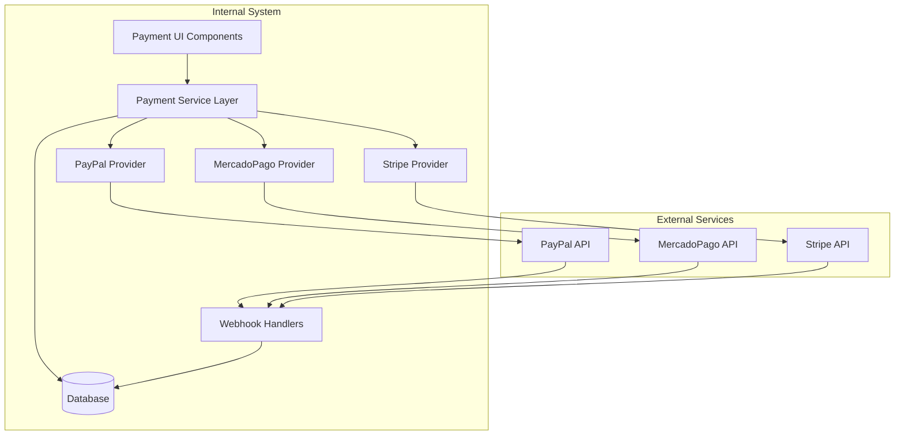

# Design Document

## Overview

This design document outlines the architecture for expanding the current Stripe-based payment system to support multiple payment providers (PayPal and MercadoPago) while maintaining a unified interface and consistent user experience. The system will leverage free sandbox environments for development and testing, providing Mexican users with comprehensive payment options including traditional cards, PayPal accounts, and local Mexican payment methods.

## Architecture

### High-Level Architecture



### Database Schema Evolution

The existing Payment model will be extended to support multiple providers while maintaining backward compatibility:

```prisma
model Payment {
  id                  String @id @default(cuid())
  userId              String
  appointmentId       String? @unique
  amount              Int
  currency            String @default("MXN")

  // Enhanced payment method tracking
  paymentMethod       String // "stripe", "paypal", "mercadopago"
  status              PaymentStatus @default(PENDING)

  // Provider-specific IDs (existing + new)
  stripePaymentId     String? @unique
  stripeSessionId     String? @unique
  paypalPaymentId     String? @unique
  paypalOrderId       String? // New field
  mercadopagoId       String? // New field

  // Enhanced metadata and tracking
  paymentData         Json? // Provider-specific data
  failureReason       String?
  refundReason        String?
  refundAmount        Int?

  // Enhanced timestamps
  paidAt              DateTime?
  refundedAt          DateTime?
  createdAt           DateTime @default(now())
  updatedAt           DateTime @updatedAt

  // Existing relations
  appointment         Appointment?
  user                User @relation(fields: [userId], references: [id], onDelete: Cascade)
  distributions       PaymentDistribution[]

  @@map("payments")
}
```

## Components and Interfaces

### 1. Payment Service Layer

**Core Interface:**

```typescript
interface PaymentProvider {
  id: "stripe" | "paypal" | "mercadopago";
  name: string;
  displayName: string;
  icon: string;
  description: string;
  fees: string;
  available: boolean;
  supportedMethods: string[];
}

interface PaymentRequest {
  appointmentId: string;
  amount: number;
  currency: string;
  description: string;
  patientEmail: string;
  patientName: string;
  returnUrl: string;
  cancelUrl: string;
}

interface PaymentResult {
  success: boolean;
  paymentId: string;
  checkoutUrl?: string;
  error?: string;
  provider: string;
  metadata?: Record<string, any>;
}
```

**Service Implementation:**

- **PaymentService Class**: Central orchestrator that routes requests to appropriate providers
- **Provider Abstraction**: Each provider implements a common interface for create, capture, and status checking
- **Error Normalization**: Consistent error handling across all providers
- **Configuration Management**: Environment-based provider configuration

### 2. Provider Implementations

#### Stripe Provider (Enhanced)

- Maintains existing functionality
- Enhanced error handling and metadata storage
- Improved webhook processing

#### PayPal Provider (New)

- **Order Creation**: Uses PayPal Orders API v2 for creating payment orders
- **Payment Capture**: Handles payment capture after user approval
- **Webhook Processing**: Processes PayPal IPN notifications
- **Sandbox Integration**: Uses PayPal Sandbox for testing

#### MercadoPago Provider (New)

- **Preference Creation**: Creates payment preferences with Mexican payment methods
- **Payment Processing**: Supports cards, OXXO, SPEI, and installments
- **Webhook Processing**: Handles MercadoPago payment notifications
- **Test Environment**: Uses MercadoPago Test credentials

### 3. API Routes Architecture

```
/api/payments/
├── stripe/
│   ├── create-session/route.ts (existing, enhanced)
│   └── webhook/route.ts (existing, enhanced)
├── paypal/
│   ├── create-order/route.ts (new)
│   ├── capture/route.ts (new)
│   └── webhook/route.ts (new)
├── mercadopago/
│   ├── create-preference/route.ts (new)
│   └── webhook/route.ts (new)
└── status/route.ts (enhanced)
```

### 4. UI Components

#### Enhanced Payment Method Selector

- **Multi-Provider Support**: Displays all available payment providers
- **Provider-Specific Information**: Shows fees, processing times, and supported methods
- **Mexican Payment Highlights**: Emphasizes local payment options for MercadoPago
- **Responsive Design**: Optimized for mobile and desktop

#### Payment Flow Components

- **Success Page**: Unified success handling for all providers
- **Error Page**: Consistent error display with retry options
- **Loading States**: Provider-specific loading indicators
- **Status Tracking**: Real-time payment status updates

## Data Models

### Payment Tracking Model

```typescript
interface PaymentRecord {
  id: string;
  appointmentId: string;
  provider: "stripe" | "paypal" | "mercadopago";
  amount: number;
  currency: string;
  status: "pending" | "completed" | "failed" | "refunded" | "cancelled";

  // Provider-specific IDs
  providerPaymentId: string;
  providerSessionId?: string;

  // Metadata
  paymentData: Record<string, any>;
  failureReason?: string;

  // Timestamps
  createdAt: Date;
  paidAt?: Date;
  updatedAt: Date;
}
```

### Provider Configuration Model

```typescript
interface ProviderConfig {
  stripe: {
    publicKey: string;
    secretKey: string;
    webhookSecret: string;
  };
  paypal: {
    clientId: string;
    clientSecret: string;
    mode: "sandbox" | "live";
    webhookId: string;
  };
  mercadopago: {
    publicKey: string;
    accessToken: string;
    webhookSecret: string;
  };
}
```

## Error Handling

### Error Classification

1. **Provider Errors**: API failures, authentication issues
2. **Network Errors**: Connectivity problems, timeouts
3. **Validation Errors**: Invalid payment data, insufficient funds
4. **System Errors**: Database failures, internal server errors

### Error Recovery Strategies

- **Automatic Retry**: For transient network errors
- **Fallback Providers**: Suggest alternative payment methods on provider failure
- **User Guidance**: Clear error messages with actionable steps
- **Admin Alerts**: Critical error notifications for system administrators

### Error Response Format

```typescript
interface PaymentError {
  code: string;
  message: string;
  provider: string;
  retryable: boolean;
  suggestedActions: string[];
  metadata?: Record<string, any>;
}
```

## Testing Strategy

### Unit Testing

- **Service Layer Tests**: Mock provider APIs and test business logic
- **Provider Tests**: Test each provider implementation independently
- **Component Tests**: UI component behavior and user interactions
- **Utility Tests**: Helper functions and data transformations

### Integration Testing

- **API Route Tests**: End-to-end API testing with mock providers
- **Database Tests**: Payment record creation and updates
- **Webhook Tests**: Webhook processing and status updates
- **Cross-Provider Tests**: Consistent behavior across providers

### End-to-End Testing

- **Payment Flow Tests**: Complete payment journeys for each provider
- **Error Scenario Tests**: Failure handling and recovery
- **Mobile Testing**: Responsive design and mobile payment flows
- **Performance Tests**: Load testing and response times

### Test Environment Setup

- **Stripe Test Mode**: Use Stripe test keys and test cards
- **PayPal Sandbox**: PayPal developer sandbox accounts
- **MercadoPago Test**: MercadoPago test environment
- **Mock Webhooks**: Local webhook testing with ngrok or similar tools

## Security Considerations

### API Security

- **Authentication**: Verify user sessions for all payment operations
- **Authorization**: Ensure users can only access their own payments
- **Rate Limiting**: Prevent abuse of payment APIs
- **Input Validation**: Sanitize and validate all payment data

### Webhook Security

- **Signature Verification**: Verify webhook signatures from all providers
- **Idempotency**: Handle duplicate webhook deliveries
- **Timeout Protection**: Prevent webhook processing delays
- **Error Logging**: Secure logging without exposing sensitive data

### Data Protection

- **PCI Compliance**: Never store card data directly
- **Encryption**: Encrypt sensitive payment metadata
- **Audit Logging**: Track all payment operations
- **Data Retention**: Implement appropriate data retention policies

## Performance Optimization

### Caching Strategy

- **Provider Configuration**: Cache provider settings
- **Payment Status**: Cache recent payment status checks
- **User Preferences**: Cache user payment method preferences
- **Rate Limit Tracking**: Cache API rate limit status

### Database Optimization

- **Indexing**: Optimize queries with appropriate indexes
- **Connection Pooling**: Efficient database connection management
- **Query Optimization**: Minimize database round trips
- **Archival Strategy**: Archive old payment records

### API Performance

- **Response Compression**: Compress API responses
- **Concurrent Processing**: Parallel provider API calls where possible
- **Timeout Management**: Appropriate timeouts for external APIs
- **Circuit Breakers**: Prevent cascading failures

## Monitoring and Analytics

### Payment Metrics

- **Success Rates**: Track payment success by provider
- **Processing Times**: Monitor payment processing duration
- **Error Rates**: Track and categorize payment failures
- **User Preferences**: Analyze payment method selection patterns

### System Health

- **Provider Availability**: Monitor external provider status
- **API Response Times**: Track performance of payment APIs
- **Webhook Delivery**: Monitor webhook processing success
- **Database Performance**: Track payment-related query performance

### Alerting

- **High Error Rates**: Alert on unusual payment failure rates
- **Provider Outages**: Notify when providers are unavailable
- **Webhook Failures**: Alert on webhook processing issues
- **Performance Degradation**: Monitor for slow payment processing

## Deployment Strategy

### Environment Configuration

- **Development**: All providers in test/sandbox mode
- **Staging**: Mirror production configuration with test credentials
- **Production**: Live provider credentials with proper security

### Migration Plan

1. **Database Migration**: Add new fields to Payment model
2. **Backward Compatibility**: Ensure existing Stripe payments continue working
3. **Feature Flags**: Gradual rollout of new payment providers
4. **Monitoring**: Enhanced monitoring during rollout
5. **Rollback Plan**: Quick rollback to Stripe-only if issues arise

### Configuration Management

- **Environment Variables**: Secure storage of provider credentials
- **Feature Toggles**: Enable/disable providers dynamically
- **A/B Testing**: Test new providers with subset of users
- **Configuration Validation**: Verify provider setup on deployment
