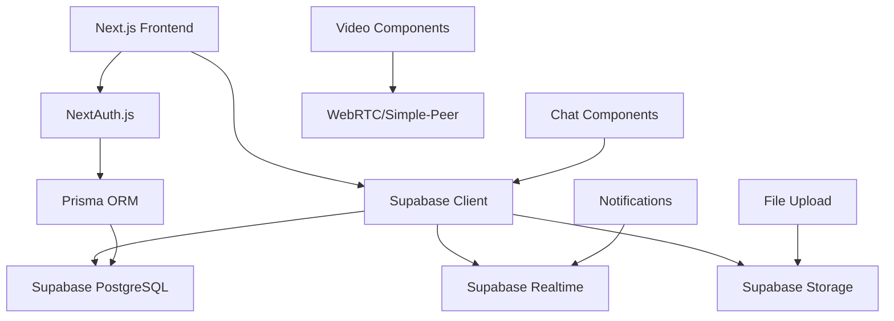

# Design Document

## Overview

The Medica Movil application has been successfully migrated from SQLite to Supabase PostgreSQL, establishing a robust foundation for real-time chat functionality between doctors and patients during virtual consultations. The migration maintains all existing functionality while adding comprehensive chat infrastructure including message handling, video sessions, notifications, and file sharing capabilities.

## Architecture

### Database Architecture

The system uses Supabase PostgreSQL as the primary database with the following architectural decisions:

- **Connection Management**: Direct PostgreSQL connection with SSL for security
- **Real-time Capabilities**: Supabase real-time subscriptions for chat functionality
- **Authentication**: NextAuth.js integration with Supabase for user management
- **File Storage**: Supabase Storage for medical files and chat attachments

### Application Architecture



## Components and Interfaces

### Core Database Models

#### Chat Infrastructure Models

1. **ChatRoom Model**
   - Links to appointments (1:1 relationship)
   - Tracks chat session lifecycle (active/ended)
   - Supports multiple video sessions per room
   - Maintains participant references (doctor/patient)

2. **ChatMessage Model**
   - Supports multiple message types (text, file, image, video, audio)
   - File attachment metadata (URL, name, size, MIME type)
   - Read status tracking
   - Sender identification and timestamps

3. **VideoSession Model**
   - WebRTC session management
   - Recording capabilities
   - Duration tracking
   - Session lifecycle management

4. **Notification Model**
   - Multi-channel support (email, SMS, WhatsApp)
   - Structured data payload
   - Read status tracking
   - User-specific targeting

### Supabase Client Configuration

#### Client Types and Usage

1. **Browser Client** (`createSupabaseBrowserClient`)
   - Used in React components
   - Handles user authentication state
   - Real-time subscriptions for chat

2. **Server Client** (`createSupabaseServerClient`)
   - Server-side operations
   - Cookie-based session management
   - API route handlers

3. **Admin Client** (`createSupabaseAdminClient`)
   - Service role operations
   - Bypasses RLS policies
   - Administrative tasks

4. **Middleware Client** (`createSupabaseMiddlewareClient`)
   - Request/response handling
   - Authentication middleware
   - Route protection

### Real-time Chat Interface

```typescript
interface ChatRoomSubscription {
  channel: string;
  event: "INSERT" | "UPDATE" | "DELETE";
  table: "chat_messages";
  filter: `room_id=eq.${roomId}`;
}

interface MessagePayload {
  id: string;
  content: string;
  messageType: MessageType;
  senderId: string;
  fileUrl?: string;
  fileName?: string;
  sentAt: DateTime;
}
```

## Data Models

### Enhanced User Relationships

The User model has been extended with chat-specific relationships:

- `chatRoomsAsPatient`: Patient's chat rooms
- `chatMessages`: All messages sent by user
- `notifications`: User-specific notifications
- `uploadedFiles`: Medical files uploaded by user

### Appointment-Chat Integration

Each appointment can have an associated chat room, enabling:

- Pre-consultation messaging
- During-consultation communication
- Post-consultation follow-up
- File sharing for medical documents

### File Management System

The MedicalFile model supports:

- Multiple file types (studies, prescriptions, documents, images, PDFs)
- File metadata tracking
- Visibility controls
- Appointment association
- User upload tracking

## Error Handling

### Database Connection Errors

1. **Connection Failures**
   - Retry logic with exponential backoff
   - Fallback to cached data when possible
   - User-friendly error messages
   - Automatic reconnection attempts

2. **Migration Errors**
   - Schema validation before deployment
   - Rollback procedures for failed migrations
   - Data integrity checks
   - Backup verification

### Real-time Connection Errors

1. **WebSocket Disconnections**
   - Automatic reconnection with exponential backoff
   - Message queue for offline periods
   - Connection status indicators
   - Graceful degradation to polling

2. **Message Delivery Failures**
   - Retry mechanisms for failed sends
   - Delivery confirmation system
   - Offline message storage
   - Conflict resolution for concurrent edits

### File Upload Errors

1. **Storage Failures**
   - Progress tracking and resumable uploads
   - File size and type validation
   - Virus scanning integration
   - Cleanup of failed uploads

2. **Permission Errors**
   - Row Level Security (RLS) policy enforcement
   - User role validation
   - File access logging
   - Secure URL generation

## Testing Strategy

### Database Testing

1. **Migration Testing**
   - Schema validation tests
   - Data integrity verification
   - Performance benchmarking
   - Rollback procedure testing

2. **Model Relationship Testing**
   - Foreign key constraint validation
   - Cascade deletion testing
   - Data consistency checks
   - Query performance optimization

### Real-time Feature Testing

1. **Chat Functionality**
   - Message delivery testing
   - Real-time synchronization validation
   - Connection resilience testing
   - Multi-user scenario testing

2. **Video Session Testing**
   - WebRTC connection establishment
   - Session recording functionality
   - Participant management
   - Network failure recovery

### Integration Testing

1. **Authentication Flow**
   - NextAuth.js with Supabase integration
   - Session management across clients
   - Role-based access control
   - Token refresh mechanisms

2. **File Upload Flow**
   - End-to-end upload process
   - File type validation
   - Storage quota management
   - Access permission verification

### Performance Testing

1. **Database Performance**
   - Query optimization validation
   - Connection pool management
   - Index effectiveness testing
   - Concurrent user load testing

2. **Real-time Performance**
   - Message latency measurement
   - Connection scalability testing
   - Memory usage monitoring
   - CPU utilization tracking

## Security Considerations

### Row Level Security (RLS)

Supabase RLS policies should be implemented for:

- Chat rooms (users can only access their own rooms)
- Messages (users can only see messages in their rooms)
- Medical files (proper access control based on appointments)
- Notifications (users can only see their own notifications)

### Data Encryption

- All data in transit encrypted via SSL/TLS
- Sensitive data encrypted at rest
- File uploads scanned for malware
- API keys and secrets properly managed

### Authentication Security

- JWT token validation
- Session timeout management
- Multi-factor authentication support
- Rate limiting on sensitive endpoints

## Deployment Considerations

### Environment Configuration

- Separate Supabase projects for development/staging/production
- Environment-specific database URLs
- Secure secret management
- Configuration validation on startup

### Monitoring and Logging

- Database performance monitoring
- Real-time connection tracking
- Error logging and alerting
- User activity analytics

### Backup and Recovery

- Automated database backups
- Point-in-time recovery capabilities
- File storage redundancy
- Disaster recovery procedures
