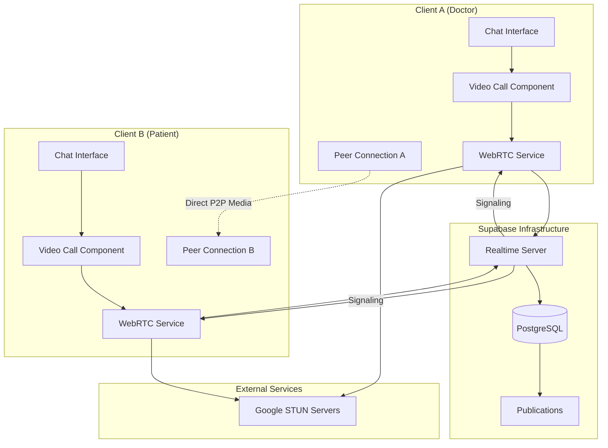
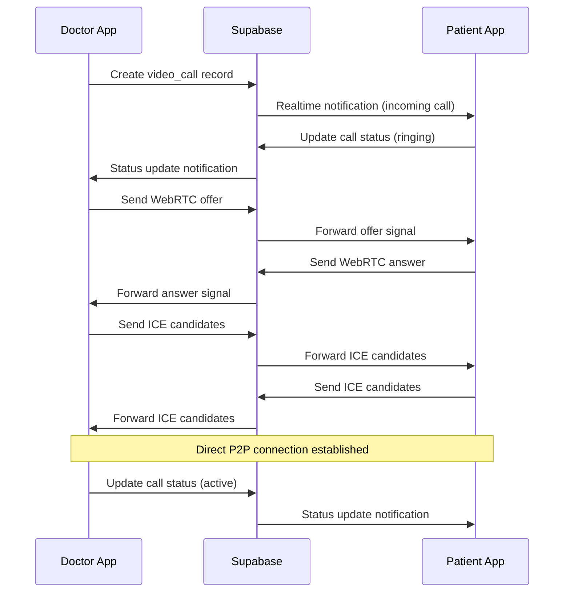

# Design Document

## Overview

The WebRTC Video Calling System is designed as a peer-to-peer communication solution that leverages native WebRTC APIs for media streaming and Supabase Realtime for signaling coordination. The system provides a complete video calling experience integrated with the existing medical chat platform, enabling doctors and patients to seamlessly transition from text-based consultations to face-to-face video interactions.

The architecture follows a distributed approach where media streams flow directly between participants (peer-to-peer) while control messages and signaling data are coordinated through Supabase's real-time infrastructure. This design ensures minimal latency for video/audio while maintaining reliable connection establishment and state management.

## Architecture

### High-Level Architecture



### Signaling Flow



## Components and Interfaces

### 1. Database Schema

#### video_calls Table

```sql
CREATE TABLE video_calls (
    id UUID PRIMARY KEY DEFAULT gen_random_uuid(),
    room_id UUID REFERENCES chat_rooms(id) ON DELETE CASCADE,
    caller_id UUID REFERENCES users(id),
    receiver_id UUID REFERENCES users(id),
    status VARCHAR(20) DEFAULT 'calling' CHECK (status IN ('calling', 'ringing', 'active', 'ended', 'declined', 'failed')),
    call_type VARCHAR(10) DEFAULT 'video' CHECK (call_type IN ('video', 'audio')),
    started_at TIMESTAMP DEFAULT NOW(),
    answered_at TIMESTAMP,
    ended_at TIMESTAMP,
    duration_seconds INTEGER,
    end_reason VARCHAR(50),
    metadata JSONB,
    created_at TIMESTAMP DEFAULT NOW()
);
```

#### webrtc_signals Table

```sql
CREATE TABLE webrtc_signals (
    id UUID PRIMARY KEY DEFAULT gen_random_uuid(),
    call_id UUID REFERENCES video_calls(id) ON DELETE CASCADE,
    sender_id UUID REFERENCES users(id),
    receiver_id UUID REFERENCES users(id),
    signal_type VARCHAR(20) NOT NULL CHECK (signal_type IN ('offer', 'answer', 'ice_candidate')),
    signal_data JSONB NOT NULL,
    created_at TIMESTAMP DEFAULT NOW()
);
```

### 2. VideoCallService Class

**Core Responsibilities:**

- Manage WebRTC peer connections
- Handle media stream acquisition and management
- Coordinate signaling through Supabase
- Manage call lifecycle and state transitions

**Key Methods:**

- `startCall(roomId, receiverId, callType)`: Initiates a new video call
- `answerCall(callId, accept)`: Responds to incoming calls
- `endCall(reason)`: Terminates active calls
- `setupPeerConnection()`: Configures WebRTC peer connection
- `handleSignal(signal)`: Processes incoming WebRTC signals

**WebRTC Configuration:**

```javascript
const rtcConfiguration = {
  iceServers: [
    { urls: "stun:stun.l.google.com:19302" },
    { urls: "stun:stun1.l.google.com:19302" },
    { urls: "stun:stun2.l.google.com:19302" },
  ],
};
```

### 3. useVideoCall Hook

**State Management:**

- `currentCall`: Active call information
- `isInCall`: Boolean indicating active call state
- `isConnecting`: Connection establishment state
- `incomingCall`: Pending incoming call data
- `callStatus`: Current call status string

**Media Controls:**

- `toggleCamera()`: Enable/disable video stream
- `toggleMicrophone()`: Enable/disable audio stream
- `localVideoRef`: Reference for local video element
- `remoteVideoRef`: Reference for remote video element

### 4. VideoCallInterface Component

**UI States:**

- **Idle**: Show call initiation button
- **Incoming**: Display accept/decline interface
- **Connecting**: Show connection progress
- **Active**: Full video interface with controls
- **Unsupported**: Fallback for incompatible browsers

**Control Features:**

- Auto-hiding controls (3-second timeout)
- Fullscreen mode toggle
- Camera/microphone toggle buttons
- Call duration display
- End call functionality

## Data Models

### VideoCall Interface

```typescript
interface VideoCall {
  id: string;
  room_id: string;
  caller_id: string;
  receiver_id: string;
  status: "calling" | "ringing" | "active" | "ended" | "declined" | "failed";
  call_type: "video" | "audio";
  started_at: string;
  answered_at?: string;
  ended_at?: string;
  duration_seconds?: number;
  end_reason?: string;
}
```

### WebRTCSignal Interface

```typescript
interface WebRTCSignal {
  id: string;
  call_id: string;
  sender_id: string;
  receiver_id: string;
  signal_type: "offer" | "answer" | "ice_candidate";
  signal_data: any;
  created_at: string;
}
```

### Media Stream Management

```typescript
interface MediaStreamState {
  localStream: MediaStream | null;
  remoteStream: MediaStream | null;
  isCameraEnabled: boolean;
  isMicrophoneEnabled: boolean;
}
```

## Error Handling

### Connection Errors

- **WebRTC Not Supported**: Display fallback message with browser requirements
- **Media Access Denied**: Provide clear instructions for enabling permissions
- **Connection Failed**: Implement retry mechanism with exponential backoff
- **Network Issues**: Display connection quality indicators and recovery options

### Signaling Errors

- **Supabase Connection Lost**: Automatic reconnection with state preservation
- **Invalid Signals**: Graceful handling of malformed WebRTC messages
- **Authentication Failures**: Redirect to login with context preservation
- **Rate Limiting**: Queue signals and implement backoff strategies

### Call State Errors

- **Unexpected Disconnection**: Attempt automatic reconnection
- **Peer Connection Failure**: Clean up resources and notify users
- **Media Stream Interruption**: Handle device changes and permissions
- **Database Sync Issues**: Implement optimistic updates with rollback

### Error Recovery Strategies

```typescript
interface ErrorRecoveryConfig {
  maxRetries: number;
  retryDelay: number;
  exponentialBackoff: boolean;
  fallbackActions: string[];
}
```

## Testing Strategy

### Unit Testing

- **VideoCallService**: Test all public methods and state transitions
- **useVideoCall Hook**: Verify state management and callback handling
- **WebRTC Utilities**: Test signal processing and connection setup
- **Error Handlers**: Validate error scenarios and recovery mechanisms

### Integration Testing

- **Supabase Integration**: Test real-time signaling and database operations
- **WebRTC Peer Connection**: Verify offer/answer/ICE candidate exchange
- **Media Stream Handling**: Test camera/microphone access and control
- **Component Integration**: Validate UI state synchronization

### End-to-End Testing

- **Complete Call Flow**: Test full call lifecycle from initiation to termination
- **Multi-Device Testing**: Verify cross-platform compatibility
- **Network Conditions**: Test under various network scenarios
- **Error Scenarios**: Validate graceful degradation and recovery

### Performance Testing

- **Connection Establishment Time**: Measure time to establish peer connection
- **Media Quality**: Monitor video/audio quality metrics
- **Resource Usage**: Track memory and CPU consumption
- **Concurrent Calls**: Test system behavior under load

### Browser Compatibility Testing

- **WebRTC Support**: Verify functionality across major browsers
- **Media Permissions**: Test permission handling variations
- **HTTPS Requirements**: Validate secure context requirements
- **Mobile Responsiveness**: Test on various mobile devices

## Security Considerations

### Authentication and Authorization

- **JWT Validation**: Verify user tokens for all WebRTC operations
- **Row Level Security**: Enforce database access policies
- **Call Permissions**: Validate user relationships before allowing calls
- **Session Management**: Handle token expiration during active calls

### Data Protection

- **Encrypted Signaling**: All signaling data transmitted over HTTPS/WSS
- **Peer-to-Peer Encryption**: WebRTC provides built-in DTLS encryption
- **Metadata Security**: Sanitize and validate all call metadata
- **Audit Logging**: Track call events for security monitoring

### Privacy Controls

- **Media Permissions**: Explicit user consent for camera/microphone access
- **Call Recording**: No recording capabilities to ensure privacy
- **Data Retention**: Configurable retention policies for call metadata
- **User Controls**: Easy access to privacy settings and call history

## Performance Optimization

### Connection Optimization

- **ICE Candidate Gathering**: Optimize STUN server selection
- **Connection Pooling**: Reuse database connections efficiently
- **Signal Batching**: Group related signals to reduce round trips
- **Lazy Loading**: Load video call components only when needed

### Media Optimization

- **Video Constraints**: Adaptive resolution based on network conditions
- **Audio Processing**: Echo cancellation and noise suppression
- **Bandwidth Management**: Dynamic quality adjustment
- **Device Selection**: Prefer higher quality devices when available

### UI Performance

- **Virtual Scrolling**: Efficient rendering of call history
- **Component Memoization**: Prevent unnecessary re-renders
- **Lazy Imports**: Code splitting for video call features
- **Resource Cleanup**: Proper disposal of media streams and connections

## Deployment Considerations

### HTTPS Requirements

- **Development**: Use ngrok or similar for local HTTPS testing
- **Production**: Vercel automatically provides HTTPS certificates
- **WebRTC Security**: Secure contexts required for media access
- **Mixed Content**: Ensure all resources loaded over HTTPS

### Environment Configuration

- **Supabase Settings**: Configure realtime subscriptions and RLS policies
- **STUN Servers**: Use reliable public STUN servers
- **Rate Limiting**: Configure appropriate limits for signaling
- **Monitoring**: Set up logging and error tracking

### Scalability Planning

- **Database Connections**: Monitor and optimize connection usage
- **Realtime Channels**: Implement channel cleanup and management
- **Signal Storage**: Consider retention policies for WebRTC signals
- **Load Testing**: Validate performance under expected user loads
