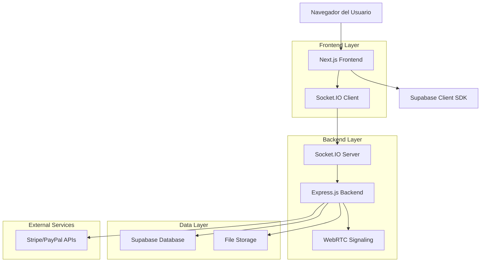
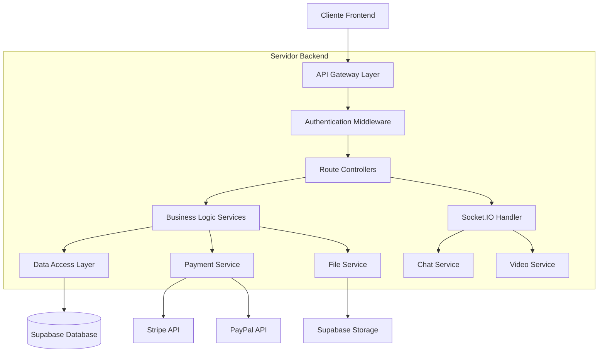
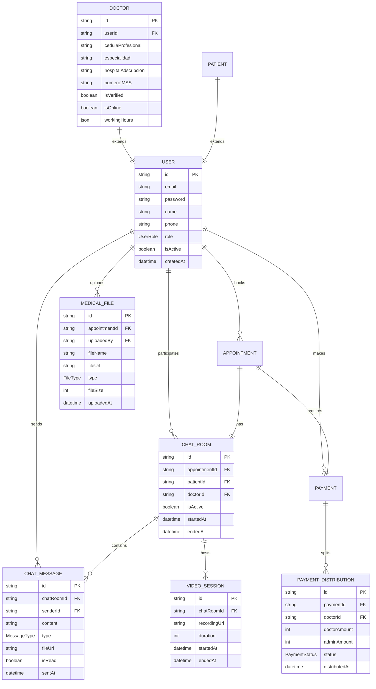

# Sistema de Chat Médico - Documento de Arquitectura Técnica

## 1. Diseño de Arquitectura



## 2. Descripción de Tecnologías

- **Frontend**: React@18 + Next.js@14 + TypeScript + Tailwind CSS + Socket.IO Client + WebRTC
- **Backend**: Node.js + Express@4 + Socket.IO + TypeScript + Prisma ORM
- **Base de Datos**: Supabase (PostgreSQL) + Redis para sesiones de chat
- **Pagos**: Stripe SDK + PayPal SDK
- **Chat en Tiempo Real**: Socket.IO + WebRTC para video
- **Almacenamiento**: Supabase Storage para archivos médicos
- **Autenticación**: NextAuth.js + Supabase Auth

## 3. Definiciones de Rutas

| Ruta | Propósito |
|------|----------|
| / | Página de inicio con búsqueda de doctores y hero section |
| /login | Autenticación de usuarios con roles diferenciados |
| /register/patient | Registro de pacientes con formulario básico |
| /register/doctor | Registro de doctores con información IMSS (solo admin) |
| /admin/dashboard | Panel de control administrativo con monitoreo en tiempo real |
| /admin/doctors | Gestión de doctores, aprobaciones y verificaciones |
| /admin/payments | Control financiero y distribución de pagos |
| /admin/chats | Monitoreo de todos los chats activos |
| /doctor/profile | Completar y editar perfil IMSS del doctor |
| /doctor/dashboard | Panel del doctor con citas y disponibilidad |
| /doctor/chat/[appointmentId] | Interfaz de chat para consultas médicas |
| /patient/search | Búsqueda y filtrado de doctores disponibles |
| /patient/dashboard | Panel del paciente con historial y citas |
| /patient/chat/[appointmentId] | Interfaz de chat para consultas médicas |
| /payment/checkout | Procesamiento de pagos con Stripe/PayPal |
| /payment/success | Confirmación de pago exitoso |
| /chat/[roomId] | Sala de chat en tiempo real |
| /video/[roomId] | Sala de video llamada WebRTC |

## 4. Definiciones de API

### 4.1 APIs Principales

**Autenticación y Usuarios**
```
POST /api/auth/login
```
Request:
| Parámetro | Tipo | Requerido | Descripción |
|-----------|------|-----------|-------------|
| email | string | true | Email del usuario |
| password | string | true | Contraseña |
| role | UserRole | true | Rol del usuario (PATIENT, DOCTOR, ADMIN) |

Response:
| Parámetro | Tipo | Descripción |
|-----------|------|-------------|
| success | boolean | Estado de la autenticación |
| user | User | Datos del usuario autenticado |
| token | string | JWT token para sesiones |

**Gestión de Doctores**
```
POST /api/admin/doctors/approve
```
Request:
| Parámetro | Tipo | Requerido | Descripción |
|-----------|------|-----------|-------------|
| doctorId | string | true | ID del doctor a aprobar |
| imssVerified | boolean | true | Verificación de credenciales IMSS |

**Sistema de Chat**
```
POST /api/chat/create
```
Request:
| Parámetro | Tipo | Requerido | Descripción |
|-----------|------|-----------|-------------|
| appointmentId | string | true | ID de la cita médica |
| patientId | string | true | ID del paciente |
| doctorId | string | true | ID del doctor |

Response:
| Parámetro | Tipo | Descripción |
|-----------|------|-------------|
| chatRoom | ChatRoom | Sala de chat creada |
| socketUrl | string | URL del servidor Socket.IO |

**Procesamiento de Pagos**
```
POST /api/payments/create-session
```
Request:
| Parámetro | Tipo | Requerido | Descripción |
|-----------|------|-----------|-------------|
| doctorId | string | true | ID del doctor seleccionado |
| consultationType | string | true | Tipo de consulta (VIRTUAL, IN_PERSON) |
| amount | number | true | Monto en pesos mexicanos |

Response:
| Parámetro | Tipo | Descripción |
|-----------|------|-------------|
| sessionId | string | ID de sesión de Stripe |
| paymentUrl | string | URL de redirección para pago |

**Subida de Archivos Médicos**
```
POST /api/files/upload
```
Request:
| Parámetro | Tipo | Requerido | Descripción |
|-----------|------|-----------|-------------|
| file | File | true | Archivo médico (PDF, imagen, documento) |
| appointmentId | string | true | ID de la cita asociada |
| fileType | string | true | Tipo de archivo (STUDY, PRESCRIPTION, DOCUMENT) |

**Distribución de Pagos**
```
POST /api/admin/payments/distribute
```
Request:
| Parámetro | Tipo | Requerido | Descripción |
|-----------|------|-----------|-------------|
| appointmentId | string | true | ID de la cita completada |
| doctorPercentage | number | true | Porcentaje para el doctor (ej: 70) |
| adminPercentage | number | true | Porcentaje para administración (ej: 30) |

## 5. Arquitectura del Servidor



## 6. Modelo de Datos

### 6.1 Definición del Modelo de Datos



### 6.2 Lenguaje de Definición de Datos (DDL)

**Tabla de Salas de Chat (chat_rooms)**
```sql
-- Crear tabla de salas de chat
CREATE TABLE chat_rooms (
    id UUID PRIMARY KEY DEFAULT gen_random_uuid(),
    appointment_id UUID UNIQUE NOT NULL REFERENCES appointments(id),
    patient_id UUID NOT NULL REFERENCES users(id),
    doctor_id UUID NOT NULL REFERENCES users(id),
    is_active BOOLEAN DEFAULT true,
    started_at TIMESTAMP WITH TIME ZONE DEFAULT NOW(),
    ended_at TIMESTAMP WITH TIME ZONE,
    created_at TIMESTAMP WITH TIME ZONE DEFAULT NOW(),
    updated_at TIMESTAMP WITH TIME ZONE DEFAULT NOW()
);

-- Crear índices
CREATE INDEX idx_chat_rooms_appointment ON chat_rooms(appointment_id);
CREATE INDEX idx_chat_rooms_patient ON chat_rooms(patient_id);
CREATE INDEX idx_chat_rooms_doctor ON chat_rooms(doctor_id);
CREATE INDEX idx_chat_rooms_active ON chat_rooms(is_active);
```

**Tabla de Mensajes de Chat (chat_messages)**
```sql
-- Crear tabla de mensajes
CREATE TABLE chat_messages (
    id UUID PRIMARY KEY DEFAULT gen_random_uuid(),
    chat_room_id UUID NOT NULL REFERENCES chat_rooms(id) ON DELETE CASCADE,
    sender_id UUID NOT NULL REFERENCES users(id),
    content TEXT,
    message_type VARCHAR(20) DEFAULT 'TEXT' CHECK (message_type IN ('TEXT', 'FILE', 'IMAGE', 'VIDEO', 'AUDIO')),
    file_url TEXT,
    file_name TEXT,
    file_size INTEGER,
    is_read BOOLEAN DEFAULT false,
    sent_at TIMESTAMP WITH TIME ZONE DEFAULT NOW()
);

-- Crear índices
CREATE INDEX idx_chat_messages_room ON chat_messages(chat_room_id);
CREATE INDEX idx_chat_messages_sender ON chat_messages(sender_id);
CREATE INDEX idx_chat_messages_sent_at ON chat_messages(sent_at DESC);
```

**Tabla de Sesiones de Video (video_sessions)**
```sql
-- Crear tabla de sesiones de video
CREATE TABLE video_sessions (
    id UUID PRIMARY KEY DEFAULT gen_random_uuid(),
    chat_room_id UUID NOT NULL REFERENCES chat_rooms(id),
    recording_url TEXT,
    duration INTEGER DEFAULT 0,
    started_at TIMESTAMP WITH TIME ZONE DEFAULT NOW(),
    ended_at TIMESTAMP WITH TIME ZONE,
    created_at TIMESTAMP WITH TIME ZONE DEFAULT NOW()
);

-- Crear índices
CREATE INDEX idx_video_sessions_room ON video_sessions(chat_room_id);
CREATE INDEX idx_video_sessions_started ON video_sessions(started_at DESC);
```

**Tabla de Distribución de Pagos (payment_distributions)**
```sql
-- Crear tabla de distribución de pagos
CREATE TABLE payment_distributions (
    id UUID PRIMARY KEY DEFAULT gen_random_uuid(),
    payment_id UUID NOT NULL REFERENCES payments(id),
    doctor_id UUID NOT NULL REFERENCES users(id),
    doctor_amount INTEGER NOT NULL,
    admin_amount INTEGER NOT NULL,
    doctor_percentage DECIMAL(5,2) NOT NULL,
    admin_percentage DECIMAL(5,2) NOT NULL,
    status VARCHAR(20) DEFAULT 'PENDING' CHECK (status IN ('PENDING', 'COMPLETED', 'FAILED')),
    distributed_at TIMESTAMP WITH TIME ZONE,
    created_at TIMESTAMP WITH TIME ZONE DEFAULT NOW()
);

-- Crear índices
CREATE INDEX idx_payment_distributions_payment ON payment_distributions(payment_id);
CREATE INDEX idx_payment_distributions_doctor ON payment_distributions(doctor_id);
CREATE INDEX idx_payment_distributions_status ON payment_distributions(status);
```

**Tabla de Archivos Médicos (medical_files)**
```sql
-- Crear tabla de archivos médicos
CREATE TABLE medical_files (
    id UUID PRIMARY KEY DEFAULT gen_random_uuid(),
    appointment_id UUID NOT NULL REFERENCES appointments(id),
    uploaded_by UUID NOT NULL REFERENCES users(id),
    file_name VARCHAR(255) NOT NULL,
    file_url TEXT NOT NULL,
    file_type VARCHAR(20) NOT NULL CHECK (file_type IN ('STUDY', 'PRESCRIPTION', 'DOCUMENT', 'IMAGE', 'PDF')),
    file_size INTEGER NOT NULL,
    mime_type VARCHAR(100),
    is_visible BOOLEAN DEFAULT true,
    uploaded_at TIMESTAMP WITH TIME ZONE DEFAULT NOW()
);

-- Crear índices
CREATE INDEX idx_medical_files_appointment ON medical_files(appointment_id);
CREATE INDEX idx_medical_files_uploader ON medical_files(uploaded_by);
CREATE INDEX idx_medical_files_type ON medical_files(file_type);
```

**Extensión de la tabla Doctor para IMSS**
```sql
-- Agregar campos específicos para IMSS a la tabla doctors
ALTER TABLE doctors ADD COLUMN cedula_profesional VARCHAR(20) UNIQUE;
ALTER TABLE doctors ADD COLUMN numero_imss VARCHAR(15);
ALTER TABLE doctors ADD COLUMN hospital_adscripcion VARCHAR(255);
ALTER TABLE doctors ADD COLUMN especialidad_imss VARCHAR(100);
ALTER TABLE doctors ADD COLUMN is_imss_verified BOOLEAN DEFAULT false;
ALTER TABLE doctors ADD COLUMN imss_verification_date TIMESTAMP WITH TIME ZONE;
ALTER TABLE doctors ADD COLUMN is_online BOOLEAN DEFAULT false;
ALTER TABLE doctors ADD COLUMN last_seen TIMESTAMP WITH TIME ZONE;

-- Crear índices adicionales
CREATE INDEX idx_doctors_cedula ON doctors(cedula_profesional);
CREATE INDEX idx_doctors_imss ON doctors(numero_imss);
CREATE INDEX idx_doctors_online ON doctors(is_online);
CREATE INDEX idx_doctors_verified ON doctors(is_imss_verified);
```

**Permisos de Supabase**
```sql
-- Permisos básicos para usuarios anónimos
GRANT SELECT ON medical_specialties TO anon;
GRANT SELECT ON mexican_states TO anon;
GRANT SELECT ON mexican_cities TO anon;

-- Permisos completos para usuarios autenticados
GRANT ALL PRIVILEGES ON chat_rooms TO authenticated;
GRANT ALL PRIVILEGES ON chat_messages TO authenticated;
GRANT ALL PRIVILEGES ON video_sessions TO authenticated;
GRANT ALL PRIVILEGES ON payment_distributions TO authenticated;
GRANT ALL PRIVILEGES ON medical_files TO authenticated;
GRANT ALL PRIVILEGES ON doctors TO authenticated;
GRANT ALL PRIVILEGES ON patients TO authenticated;
GRANT ALL PRIVILEGES ON appointments TO authenticated;
GRANT ALL PRIVILEGES ON payments TO authenticated;
```

**Datos Iniciales**
```sql
-- Insertar especialidades médicas IMSS
INSERT INTO medical_specialties (name) VALUES 
('Medicina Familiar'),
('Medicina Interna'),
('Pediatría'),
('Ginecología y Obstetricia'),
('Cirugía General'),
('Cardiología'),
('Dermatología'),
('Oftalmología'),
('Ortopedia y Traumatología'),
('Psiquiatría'),
('Neurología'),
('Urología'),
('Otorrinolaringología'),
('Anestesiología'),
('Radiología e Imagen');

-- Insertar usuario administrador inicial
INSERT INTO users (email, password, name, role, is_active) VALUES 
('admin@medicamovil.mx', '$2b$10$hashedpassword', 'Administrador Sistema', 'ADMIN', true);
```