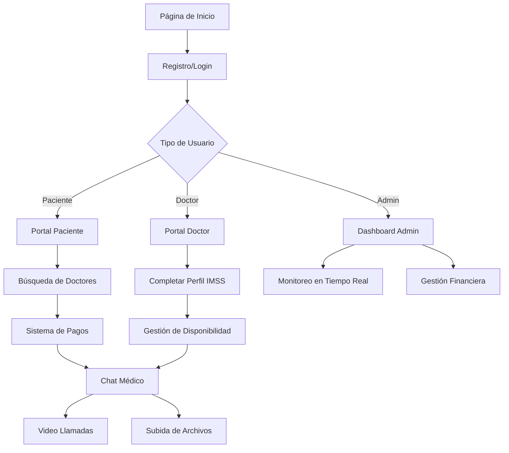

# Sistema de Chat Médico - Documento de Requerimientos del Producto

## 1. Visión General del Producto

Sistema integral de consultas médicas digitales tipo Doctoralia que facilita la comunicación en tiempo real entre doctores y pacientes a través de chat de texto, video llamadas y compartición de archivos médicos. El administrador mantiene control total sobre las interacciones, pagos y calidad del servicio, con enfoque específico en el sistema de salud mexicano IMSS.

El producto resuelve la necesidad de consultas médicas remotas seguras y monitoreadas, permitiendo a pacientes acceder a atención médica especializada desde cualquier ubicación mientras garantiza la calidad del servicio a través de supervisión administrativa.

## 2. Funcionalidades Principales

### 2.1 Roles de Usuario

| Rol | Método de Registro | Permisos Principales |
|-----|-------------------|---------------------|
| Administrador | Acceso directo del sistema | Control total: gestión de doctores, monitoreo de chats, distribución de pagos, supervisión de calidad |
| Doctor | Solo agregado por administrador | Completar perfil IMSS, participar en chats, recibir pagos, gestionar horarios |
| Paciente | Registro libre con email | Buscar doctores, realizar pagos, iniciar chats, subir documentos médicos |

### 2.2 Módulos del Sistema

Nuestro sistema de chat médico consta de las siguientes páginas principales:

1. **Página de Inicio**: hero section con búsqueda de especialidades, navegación principal, estadísticas de doctores disponibles
2. **Dashboard Administrativo**: panel de control total, monitoreo de chats en tiempo real, gestión financiera, aprobación de doctores
3. **Portal del Doctor**: completar perfil IMSS, gestión de disponibilidad, chat con pacientes, historial de consultas
4. **Portal del Paciente**: búsqueda de doctores, sistema de pagos, chat con doctor asignado, historial médico
5. **Sistema de Chat**: interfaz de chat en tiempo real, subida de archivos, video llamadas, monitoreo administrativo
6. **Gestión de Pagos**: procesamiento Stripe/PayPal, distribución automática, reportes financieros
7. **Registro y Autenticación**: formularios específicos por rol, verificación IMSS para doctores

### 2.3 Detalles de Páginas

| Página | Módulo | Descripción de Funcionalidades |
|--------|--------|---------------------------------|
| Página de Inicio | Hero Section | Búsqueda por especialidad médica, filtros por ubicación, mostrar doctores disponibles en línea |
| Página de Inicio | Navegación Principal | Acceso a registro/login, información del servicio, estadísticas en tiempo real |
| Dashboard Admin | Monitoreo en Tiempo Real | Visualizar todos los chats activos, intervenir en conversaciones, evaluar calidad del servicio |
| Dashboard Admin | Gestión de Doctores | Aprobar/rechazar registros, verificar credenciales IMSS, gestionar disponibilidad |
| Dashboard Admin | Control Financiero | Procesar pagos recibidos, calcular comisiones, distribuir pagos a doctores, generar reportes |
| Portal Doctor | Perfil IMSS | Completar información legal: cédula profesional, especialidad, hospital de adscripción, horarios |
| Portal Doctor | Chat Médico | Interfaz de chat con pacientes asignados, acceso a historial médico, herramientas de diagnóstico |
| Portal Doctor | Gestión de Citas | Configurar disponibilidad, aceptar/rechazar asignaciones, completar consultas |
| Portal Paciente | Búsqueda de Doctores | Filtrar por especialidad, ubicación, disponibilidad, calificaciones, precios |
| Portal Paciente | Sistema de Pagos | Integración Stripe/PayPal, selección de método de pago, confirmación de transacción |
| Portal Paciente | Chat Médico | Comunicación con doctor asignado, subida de estudios médicos, recepción de recetas |
| Sistema de Chat | Chat de Texto | Mensajería en tiempo real, historial completo, notificaciones, estado de conexión |
| Sistema de Chat | Subida de Archivos | Compartir estudios médicos, radiografías, análisis, documentos PDF, imágenes |
| Sistema de Chat | Video Llamadas | Integración WebRTC, grabación de sesiones, calidad de video adaptativa |
| Sistema de Chat | Monitoreo Admin | Supervisión en tiempo real, intervención cuando sea necesario, evaluación de calidad |
| Gestión de Pagos | Procesamiento | Recepción de pagos de pacientes, validación de transacciones, manejo de reembolsos |
| Gestión de Pagos | Distribución | Cálculo automático de comisiones, transferencias a doctores, reportes de ingresos |
| Registro/Login | Registro Paciente | Formulario básico con datos personales, verificación de email, creación de perfil |
| Registro/Login | Registro Doctor | Formulario IMSS completo, verificación de credenciales, aprobación administrativa |

## 3. Flujo Principal del Sistema

### Flujo del Paciente:
1. Registro en la plataforma con datos básicos
2. Búsqueda de doctor por especialidad y disponibilidad
3. Selección de doctor y realización de pago
4. Asignación automática y notificación al doctor
5. Inicio de chat médico con doctor conectado
6. Consulta a través de chat de texto, archivos y video
7. Finalización de consulta y evaluación del servicio

### Flujo del Doctor:
1. Invitación y registro por parte del administrador
2. Completar perfil con información IMSS requerida
3. Aprobación administrativa y activación de cuenta
4. Configuración de disponibilidad y conexión al sistema
5. Recepción de asignación de paciente pagado
6. Realización de consulta médica via chat
7. Recepción de pago distribuido por administrador

### Flujo del Administrador:
1. Gestión de invitaciones y aprobaciones de doctores
2. Monitoreo continuo de chats y calidad del servicio
3. Procesamiento y distribución de pagos
4. Supervisión de métricas y reportes del sistema

## 4. Diseño de Interfaz de Usuario

### 4.1 Estilo de Diseño

- **Colores Primarios**: Azul médico (#2563EB), Verde salud (#059669), Blanco clínico (#FFFFFF)
- **Colores Secundarios**: Gris profesional (#6B7280), Azul claro (#DBEAFE), Verde claro (#D1FAE5)
- **Estilo de Botones**: Redondeados con sombras suaves, efectos hover, iconos médicos
- **Tipografía**: Inter para textos principales (16px), títulos en Poppins (24px-32px), monospace para datos técnicos
- **Layout**: Diseño tipo dashboard con sidebar, cards para información médica, navegación superior fija
- **Iconos**: Lucide React con temática médica, emojis de salud 🏥⚕️💊🩺

### 4.2 Diseño por Página

| Página | Módulo | Elementos de UI |
|--------|--------|-----------------|
| Página de Inicio | Hero Section | Gradiente azul médico, buscador prominente, cards de especialidades, contador de doctores en línea |
| Dashboard Admin | Panel de Control | Layout de 3 columnas, gráficos en tiempo real, tabla de chats activos, métricas financieras |
| Portal Doctor | Perfil IMSS | Formulario estructurado, validación en tiempo real, progress bar, iconos de verificación |
| Portal Paciente | Búsqueda | Grid de cards de doctores, filtros laterales, mapas de ubicación, sistema de calificaciones |
| Sistema de Chat | Interfaz de Chat | Diseño tipo WhatsApp, burbujas de mensajes, indicadores de estado, botones de archivos y video |
| Gestión de Pagos | Procesamiento | Formularios seguros, logos de métodos de pago, confirmaciones visuales, reportes tabulares |

### 4.3 Responsividad

Diseño mobile-first con adaptación completa para tablets y desktop. Optimización táctil para chat médico en dispositivos móviles, con gestos intuitivos para subida de archivos y navegación entre conversaciones.