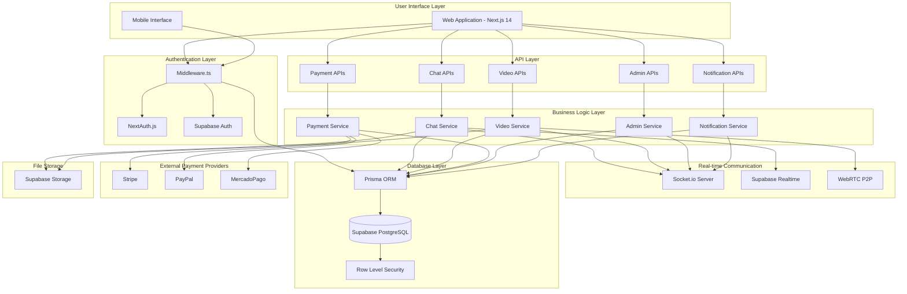
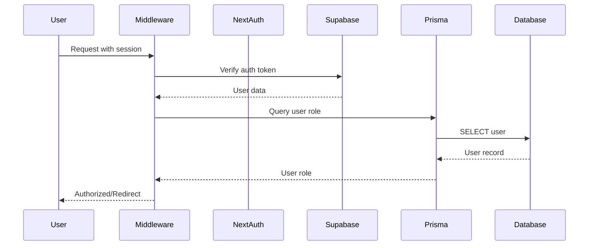
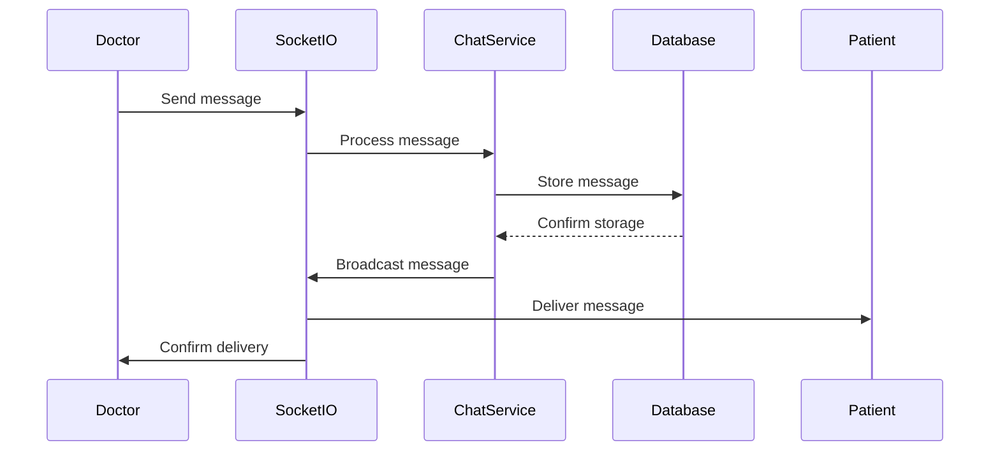
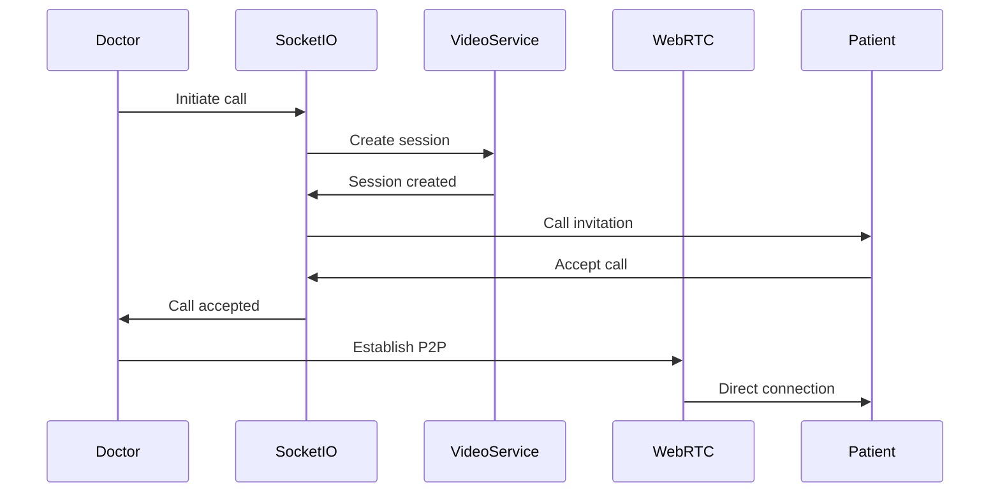
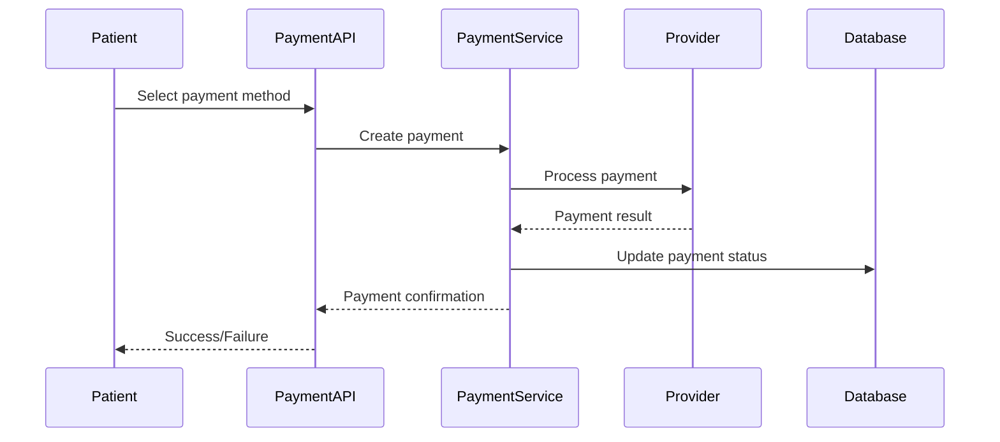
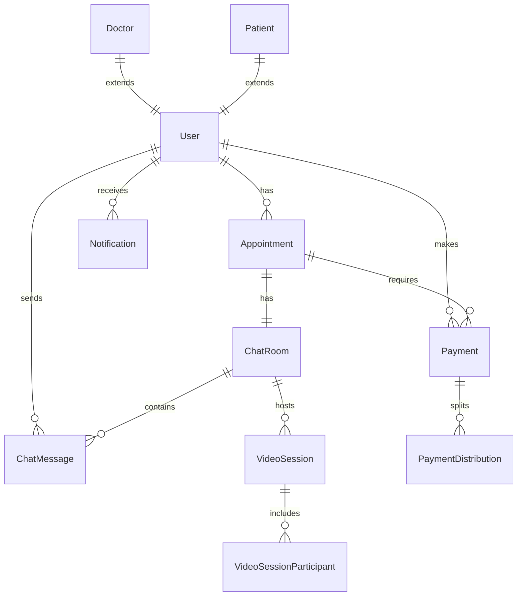

# System Architecture Diagram

## Current System Architecture



## Integration Flow Diagrams

### Authentication Flow



### Real-time Chat Flow



### Video Call Flow



### Payment Processing Flow



## Component Architecture

### Frontend Component Hierarchy

```
App (Next.js 14)
├── Layout Components
│   ├── MainNav
│   ├── Footer
│   └── Providers
├── Feature Components
│   ├── Admin Dashboard
│   │   ├── Chat Monitoring
│   │   ├── Video Analytics
│   │   ├── Payment Dashboard
│   │   └── Notification Bell
│   ├── Chat System
│   │   ├── Chat Interface
│   │   ├── Message List
│   │   ├── Message Input
│   │   └── File Upload
│   ├── Video Calls
│   │   ├── Video Interface
│   │   ├── Call Controls
│   │   └── Waiting Room
│   └── Payment System
│       ├── Method Selector
│       ├── Provider Forms
│       └── Success/Error Pages
└── Shared Components
    ├── UI Library (Radix + Tailwind)
    ├── Error Boundaries
    └── Loading States
```

### Backend Service Architecture

```
API Routes (Next.js App Router)
├── Authentication
│   ├── NextAuth Configuration
│   └── Registration Endpoints
├── Admin Services
│   ├── Monitoring APIs
│   ├── Analytics APIs
│   └── Management APIs
├── Chat Services
│   ├── Room Management
│   ├── Message APIs
│   └── File Upload
├── Video Services
│   ├── Session Management
│   └── Signaling APIs
├── Payment Services
│   ├── Multi-provider APIs
│   ├── Webhook Handlers
│   └── Status Tracking
└── Notification Services
    ├── Real-time Notifications
    └── Preference Management
```

## Database Schema Overview

### Core Entities



### Integration Tables

- **AdminNotification**: Cross-system admin alerts
- **ChatAnalytics**: Chat system metrics
- **PaymentMetrics**: Payment provider analytics
- **SystemHealth**: Overall system monitoring
- **AdminAction**: Audit trail for admin actions

## Technology Stack Integration

### Frontend Stack

- **Framework**: Next.js 14 with App Router
- **UI Library**: Radix UI + Tailwind CSS
- **State Management**: Zustand + React Query
- **Real-time**: Socket.io Client + Supabase Realtime
- **Video**: WebRTC APIs

### Backend Stack

- **Runtime**: Node.js with Next.js API Routes
- **Database**: Supabase PostgreSQL with Prisma ORM
- **Authentication**: NextAuth.js + Supabase Auth
- **Real-time**: Socket.io + Supabase Realtime
- **File Storage**: Supabase Storage

### External Integrations

- **Payment Providers**: Stripe, PayPal, MercadoPago
- **Communication**: WebRTC for video calls
- **Monitoring**: Custom analytics and health checks

## Security Architecture

### Authentication Security

- **Multi-layer Auth**: NextAuth + Supabase + Prisma
- **Session Management**: Secure cookie-based sessions
- **Role-based Access**: Middleware-enforced permissions

### Database Security

- **Row Level Security**: Comprehensive RLS policies
- **Data Encryption**: At-rest and in-transit encryption
- **Audit Logging**: Complete action tracking

### API Security

- **Authentication Required**: All protected endpoints
- **Rate Limiting**: Planned implementation
- **Input Validation**: Zod schema validation

## Performance Considerations

### Current Optimizations

- **Database Indexing**: Proper indexes on frequently queried fields
- **Connection Pooling**: Prisma connection management
- **Component Lazy Loading**: Dynamic imports for large components

### Areas for Improvement

- **Query Optimization**: Cross-system query consolidation
- **Caching Strategy**: Redis implementation planned
- **CDN Integration**: Static asset optimization

## Monitoring and Observability

### Current Monitoring

- **Admin Dashboard**: Real-time system monitoring
- **Health Checks**: API endpoint health monitoring
- **Error Tracking**: Error boundaries and logging

### Planned Enhancements

- **Performance Metrics**: Response time tracking
- **User Analytics**: Usage pattern analysis
- **Alert System**: Automated issue detection

This architecture diagram provides a comprehensive view of the current system integration and serves as the foundation for the upcoming consolidation and optimization tasks.
